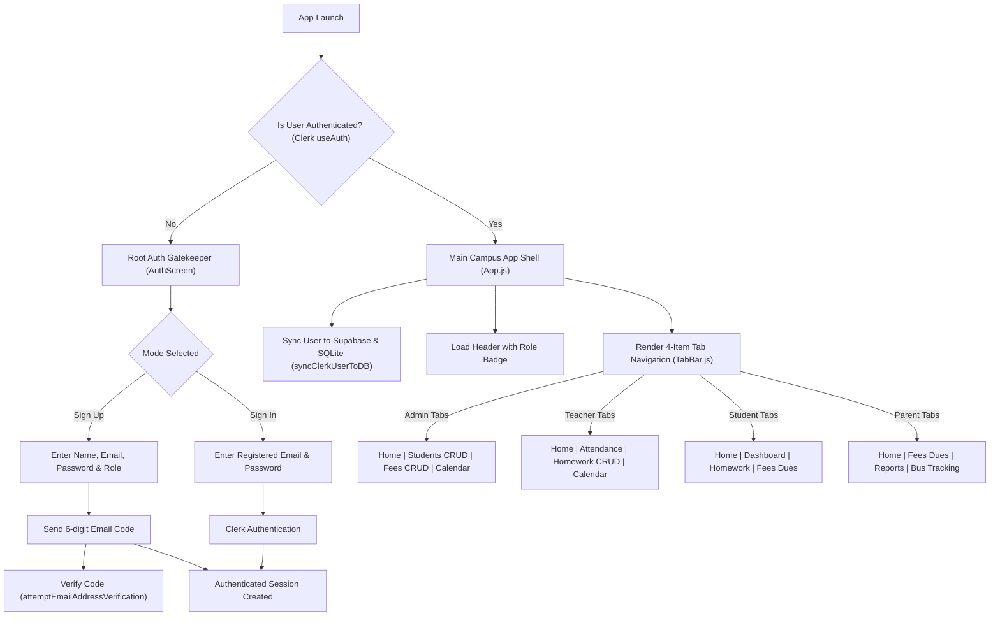

# 🏫 Vidhya Sager Public School (VSPS) - Smart Campus App

A modern, high-performance, role-based mobile application for Vidhya Sager Public School built with **React Native**, **Expo 51**, **Clerk Authentication**, **Supabase Cloud PostgreSQL Database**, and **Expo SQLite**.

---

## 🌟 Table of Contents
1. [App Overview](#-app-overview)
2. [Key Features](#-key-features)
3. [Entire Application Architecture & User Flow](#-entire-application-architecture--user-flow)
4. [Project Folder Structure](#-project-folder-structure)
5. [Database Architecture & Supabase Setup](#-database-architecture--supabase-setup)
6. [Role-Based Access & Capabilities](#-role-based-access--capabilities)
7. [Installation & Getting Started](#-installation--getting-started)
8. [Future Enhancement Opportunities](#-future-enhancement-opportunities)

---

## 📱 App Overview

The **VSPS Smart Campus App** provides a unified mobile platform for Students, Parents, Teachers, and Administrators. It manages attendance, homework assignments, tuition fee dues, digital ID cards, school circulars, transport monitoring, and staff directories.

---

## ⚡ Key Features

- 🔐 **Strict Authentication Gatekeeper**: Secured via **Clerk Cloud Identity Platform** with mandatory 6-digit email MFA verification. Unauthenticated users only see the Sign In / Sign Up portal.
- 🔄 **Dual Hybrid Database Architecture**:
  - **Primary**: Supabase Cloud PostgreSQL database for live multi-user cloud synchronization.
  - **Fallback/Cache**: Expo SQLite (`vsps_school.db`) + `AsyncStorage` for offline caching.
- 👥 **Role-Driven Experience**: Dynamic role mapping (`Admin`, `Teacher`, `Student`, `Parent`).
- 🎨 **Minimal & Modern UI**: Sleek slate & indigo palette, rounded card layouts (`14px`), clean icons, and subtle elevation shadows.
- 📱 **Clean 4-Item Bottom Navigation Bar**: Role-customized icon navigation bar (`Home`, `Students/Attendance/Dashboard`, `Fees/Homework`, `Calendar/Bus`).

---

## 🔄 Entire Application Architecture & User Flow



### Detailed Flow Explanation:

1. **Authentication Stage**:
   - The root container `App.js` checks Clerk authentication state using `useAuth()`.
   - If `!isSignedIn`, the application renders **ONLY** the `AuthScreen`. All inside campus screens and navigation bars are completely hidden.
   - On **Sign Up**, the user selects their role (`Admin`, `Teacher`, `Student`, `Parent`). Clerk registers the account with `{ unsafeMetadata: { role } }` and sends a 6-digit email code.
   - After entering the OTP, Clerk completes the session and grants entry.

2. **Session Initialization & Data Sync**:
   - Once signed in, `syncClerkUserToDB(currentUser)` runs in the background.
   - It upserts the user into the **Supabase Cloud PostgreSQL `students` table** and caches the profile locally in **Expo SQLite** and `AsyncStorage`.

3. **Role & Navigation Rendering**:
   - `Header.js` displays a welcoming message, session auto-lock countdown timer, and a badge matching the logged-in user's role.
   - `TabBar.js` renders a 4-item icon bottom bar corresponding to the user's role:
     - **Admin**: `Home`, `Students` (CRUD), `Fees` (CRUD), `Calendar`.
     - **Teacher**: `Home`, `Attendance`, `Homework` (Create/Delete), `Calendar`.
     - **Student**: `Home`, `Dashboard`, `Homework`, `Fees`.
     - **Parent**: `Home`, `Fees`, `Reports`, `Bus`.

4. **Cloud Database Operations**:
   - When an **Admin** adds/edits/deletes a student or fee item, `saveStudentToDB` / `saveFeeToDB` performs an `INSERT`/`UPDATE`/`DELETE` query directly on **Supabase Cloud** and updates local SQLite.
   - When a **Teacher** assigns or deletes homework, `saveHomeworkToDB` / `deleteHomeworkFromDB` syncs directly with Supabase.

---

## 📁 Project Folder Structure

```
vsps-school-app/
├── App.js                      # Main container & navigation controller
├── storage.js                  # Hybrid Supabase Cloud & SQLite data persistence layer
├── authUtils.js                # Secure token cache & Clerk error formatting helpers
├── .env                        # Supabase environment variables (URL & Key)
├── supabase_schema.sql         # SQL schema script for Supabase PostgreSQL tables & seed data
├── package.json                # Project dependencies and scripts
└── src/
    ├── constants/
    │   ├── theme.js            # Color tokens, Clerk Publishable Key, roles
    │   └── mockData.js         # Static datasets (calendar, news, staff, receipts)
    ├── styles/
    │   └── styles.js           # Centralized StyleSheet export
    ├── services/
    │   └── supabase.js         # Supabase client initializer
    ├── components/
    │   ├── layout/
    │   │   ├── Header.js       # Top brand bar, user welcome, role badge, session lock
    │   │   └── TabBar.js       # 4-item icon bottom navigation bar
    │   ├── common/
    │   │   ├── PrimaryButton.js # Styled action button
    │   │   ├── SectionTitle.js  # Clean section title
    │   │   ├── StatusPill.js    # Present/Absent/Late status pill
    │   │   ├── Metric.js        # Metric value & label block
    │   │   └── StatsRow.js      # Student dashboard metric row
    │   └── widgets/
    │       ├── ActionCard.js    # Home screen quick action tile
    │       ├── RoleFeaturePanel.js # Feature overview list per role
    │       └── MessageBubble.js # Direct message chat bubble
    └── screens/
        ├── HomeScreen.js        # Portal dashboard & quick actions
        ├── NotificationsScreen.js # Emergency alerts & targeted notifications
        ├── CalendarScreen.js   # Academic calendar & event timeline
        ├── NewsScreen.js       # Campus news & debate highlights
        ├── AttendanceScreen.js # Mobile attendance tracker with guardian alerts
        ├── GradebookScreen.js  # SIS exam grade management
        ├── HomeworkScreen.js   # Homework portal (Teacher CRUD + Student list)
        ├── DashboardScreen.js  # Student overview (timetable & stats)
        ├── TimetableScreen.js  # Room & lab class timetable schedule
        ├── FeesScreen.js       # Fee management (Admin CRUD + Payment breakdown)
        ├── ReportsScreen.js    # Term growth charts & teacher feedback
        ├── MessagesScreen.js   # Direct messaging prototype
        ├── BusTrackingScreen.js # Live route map mock & bus locator
        ├── TransportAdminScreen.js # Transport route status overview
        ├── StaffDirectoryScreen.js # Faculty & administration contact list
        ├── SecurityCenterScreen.js # Clerk authentication security features
        ├── NewslettersScreen.js # Circular broadcasts for guardians
        ├── StudentsManagerScreen.js # Admin student CRUD synced with Supabase
        ├── DigitalIdsScreen.js # Digital student ID cards with local/cloud count
        ├── ResourcesScreen.js  # E-book & worksheet resource library
        └── AuthScreen.js       # Clerk Sign In / Sign Up & 6-digit OTP verification
```

---

## 🗄️ Database Architecture & Supabase Setup

### Environment Variables Configuration (`.env`)
Create a `.env` file from `.env.example` in the root directory:
```env
EXPO_PUBLIC_SUPABASE_URL=your_supabase_url_here
EXPO_PUBLIC_SUPABASE_KEY=your_supabase_publishable_key_here
EXPO_PUBLIC_CLERK_PUBLISHABLE_KEY=your_clerk_publishable_key_here
```

### Supabase SQL Migration (`supabase_schema.sql`)
To set up tables in your Supabase project:
1. Open your **Supabase Dashboard** -> **SQL Editor**.
2. Paste the contents of `supabase_schema.sql` and click **Run**.

It automatically creates the following tables:
- **`students`**: Member records (`id`, `name`, `email`, `phone`, `class_section`, `roll_no`, `role`, `onboarding_code`, `created_at`)
- **`teachers`**: Faculty directory (`id`, `name`, `email`, `phone`, `subject`, `department`, `created_at`)
- **`admins`**: Administrator accounts (`id`, `name`, `email`, `phone`, `role`, `created_at`)
- **`attendance`**: Daily records (`id`, `student_id` [FK -> students], `date`, `status`, `updated_at`)
- **`homework`**: Assignments (`id`, `subject`, `task`, `due_date`, `class_section`, `created_at`)
- **`fees`**: Tuition dues (`id`, `student_id` [FK -> students], `label`, `amount`, `status`, `created_at`)

---

## 🔐 Security & Role-Based Authorization Architecture

- **Default Role for Public Sign-Ups**: All new users registering through the app are assigned the **`Student`** role by default. Public role selection is disabled on registration to prevent unauthorized privilege escalation.
- **Supabase Database as Single Source of Truth**:
  - Upon user sign in, the app queries Supabase PostgreSQL tables (`students` & `admins`) for the account's email.
  - To grant **`Admin`** or **`Teacher`** access to any user, set their `role` column in Supabase to `'Admin'` or `'Teacher'`.
  - Pre-configured admins (`anandnimcet2020@gmail.com` & `rrptdr@gmail.com`) automatically resolve as **`Admin`**.

| Role | Bottom Navigation Tabs | Key Capabilities |
| :--- | :--- | :--- |
| **Admin** | `Home`, `Students`, `Fees`, `Calendar` | • Full CRUD for Students in Supabase<br>• Full CRUD for Fee dues in Supabase<br>• Send push notifications & monitor transport |
| **Teacher** | `Home`, `Attendance`, `Homework`, `Calendar` | • Assign and delete homework in Supabase<br>• Mark attendance & notify parents<br>• Gradebook sync |
| **Student** | `Home`, `Dashboard`, `Homework`, `Fees` | • View timetable & daily schedule<br>• Download learning worksheets<br>• Track academic growth & fee dues |
| **Parent** | `Home`, `Fees`, `Reports`, `Bus` | • Pay fee dues securely with OTP<br>• Monitor bus GPS route in real-time<br>• Review teacher feedback |

---

## 🚀 Installation & Getting Started

### Prerequisites
- Node.js (v18+)
- Expo CLI (`npm i -g expo-cli`)
- iOS Simulator (macOS) or Expo Go App (Android/iOS)

### Step-by-Step Setup
1. **Install Dependencies**:
   ```bash
   npm install
   ```

2. **Run Metro Development Server**:
   ```bash
   npm start
   ```

3. **Launch on iOS Simulator**:
   ```bash
   npm run ios
   ```

4. **Launch on Android**:
   ```bash
   npm run android
   ```

---

## 💡 Future Enhancement Opportunities

Here are recommended features you can implement next to expand the application:

1. **⚡ Real-time Supabase WebSockets Subscription**:
   - Subscribe to live changes on the `homework` and `fees` tables using `supabase.channel('public:fees').on(...)` so student/parent UI updates instantly without refreshing.

2. **🔔 Native Push Notifications via Expo Notifications**:
   - Integrate `expo-notifications` to send real push notifications to guardians when attendance is marked *Absent* or new homework is published.

3. **💳 Payment Gateway Integration (Razorpay / Stripe)**:
   - Connect a live payment gateway SDK inside `FeesScreen.js` for instant digital fee settlements.

4. **📄 PDF Report Card & Fee Receipt Generator**:
   - Use `expo-print` and `expo-sharing` to generate downloadable PDF receipts and report cards directly from the app.

5. **📍 Real-time GPS Bus Tracking**:
   - Integrate `react-native-maps` and `expo-location` for live driver GPS tracking on route maps.

---

## 📄 License
This project is proprietary software for **Vidhya Sager Public School (VSPS)**. All rights reserved.
